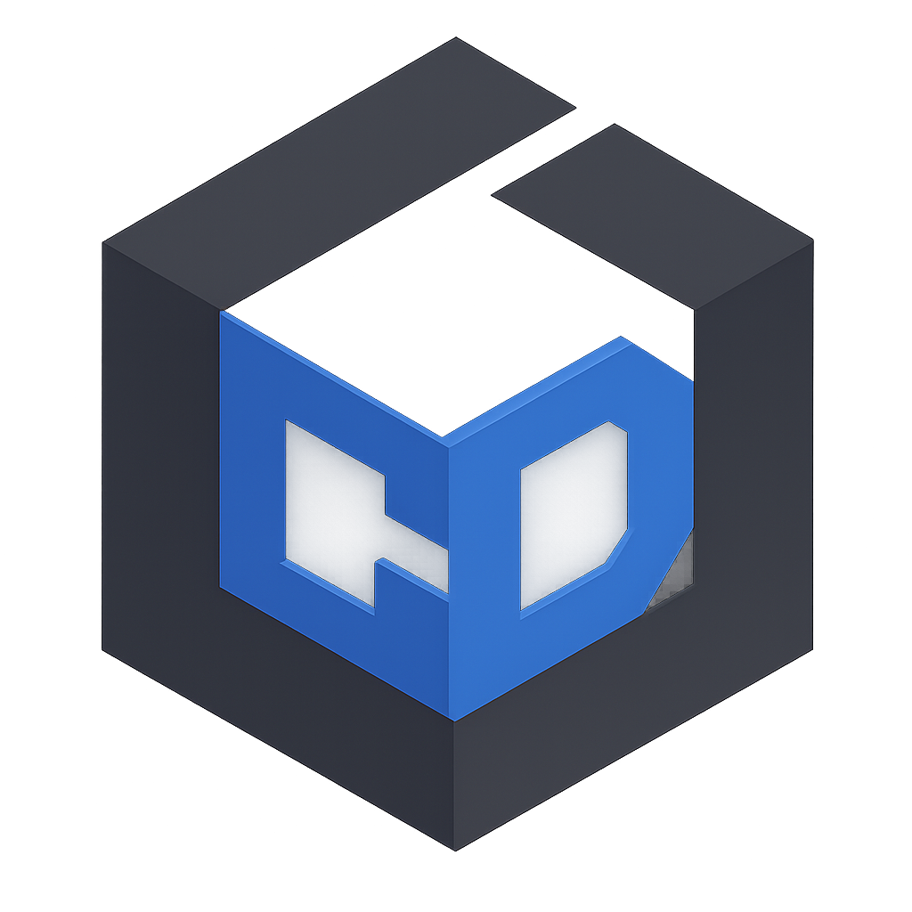

  <h1>CraftDock</h1>
  
A lightweight, modern Minecraft launcher built with Electron.

  
  
  
  

 
  
 

---

> ⚠️ **This project is currently in Closed Beta.**
> Public beta is planned for **June 30, 2026**. Features may change and bugs are expected.
> Found something broken? [Open an issue](https://github.com/RealGeegamr/CraftDock/issues) or [join the Discord](https://discord.gg/pNKnKNdDc4).

---

## Features

- **Modpack browser** — search and install modpacks from Modrinth and CurseForge in one click
- **Instance manager** — each modpack gets its own isolated folder with mods, saves, configs, and resource packs
- **Mod browser & version picker** — browse mods from Modrinth, choose any specific version with compatibility badges for your MC version and loader
- **Mod update checker** — check for mod updates per-instance with one click; update individually or in bulk
- **Direct Java launch** — launches Minecraft directly (no external launcher needed), with Fabric, Forge, NeoForge, and Quilt support
- **Server manager** — spin up Paper, Purpur, Vanilla, Fabric, or Forge servers with live console, player management, backups, and auto-shutdown
- **Join server from launcher** — click Join on any saved multiplayer server to launch the instance and connect automatically
- **Shared worlds** — link multiple instances to one `saves/` folder via symlinks using a World Tag
- **Shared server lists** — link multiple instances to one `servers.dat` via symlinks using a Server Tag
- **Resource pack / shader / data pack browser** — browse Modrinth and install directly to any instance
- **Skin manager** — upload, preview, and apply skins with 3D preview canvas, cape selector, and player skin downloader
- **Microsoft login** — full Microsoft OAuth via device code flow with encrypted token storage
- **Update checker** — checks GitHub releases on startup (toggleable) with in-app banner
- **Playtime tracking** — see hours played per instance on the home dashboard
- **Export** — export instances as CurseForge .zip, Modrinth .mrpack, CF share code, or Modrinth link

---

## Beta Roadmap

| Milestone | Target |
|-----------|--------|
| Closed Beta (current) | Now |
| CurseForge Browsing | TBD |
| Export / Import | TBD |
| Bug fixes & polish before public release | Ongoing |
| Public Beta | **June 30, 2026** |
| v1.0 Release | TBD |

During closed beta, access is limited to testers. Join the [Discord](https://discord.gg/pNKnKNdDc4) to request access or follow progress.

---

## Contributing

Bug reports via [GitHub Issues](https://github.com/RealGeegamr/CraftDock/issues) are welcome. Please include your OS, Electron version, and steps to reproduce.
For general feedback and discussion, join the [Discord server](https://discord.gg/pNKnKNdDc4).

---

## License

Apache 2.0 — see [LICENSE](LICENSE) for details.

---

  
    
  Built with Electron · Not affiliated with Mojang or Microsoft

