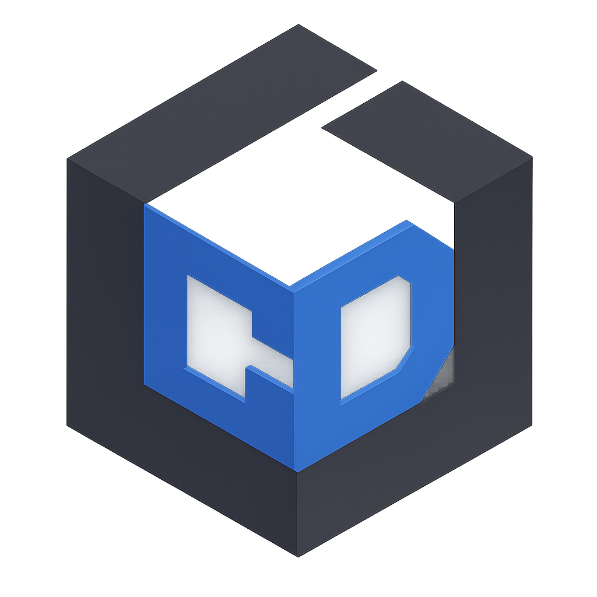

  <h1>CraftDock</h1>
  
A lightweight, modern Minecraft launcher built with Electron.

  
  
  
  

 
  
 

---

> ⚠️ **This project is currently in Closed Beta.**
> Public beta is planned for **June 30, 2026**. Features may change and bugs are expected.
> Found something broken? [Open an issue](https://github.com/Geegamr/CraftDock/issues) or [join the Discord](https://discord.gg/pNKnKNdDc4).

---

## Features

- **Modpack browser** — search and install from Modrinth and CurseForge
- **Import / Export** — import CurseForge `.zip` or Modrinth `.mrpack`; export as zip, mrpack, CF code, or Modrinth link
- **Instance manager** — isolated folder per instance with mods, saves, configs, screenshots, and resource packs
- **Mod browser & version picker** — browse Modrinth with version compatibility badges for your MC version and loader
- **Mod update checker** — check and update mods per-instance individually or in bulk
- **Direct Java launch** — no external launcher needed; supports Fabric, Forge, NeoForge, and Quilt
- **Auto Java management** — picks the right Java per MC version; auto-downloads it privately if missing — system Java never touched
- **Server manager** — Paper, Purpur, Vanilla, Fabric, or Forge servers with live console, backups, and auto-shutdown
- **Join server from launcher** — launch an instance and connect to a server in one click
- **World / Server / Resource Tags** — symlink `saves/`, `servers.dat`, or `resourcepacks/` across multiple instances
- **Resource pack, shader & data pack browser** — Modrinth browser with version picker, installs directly to any instance
- **Config file editor** — edit `.toml`, `.json`, `.yaml`, `.cfg` and more directly in the launcher; system editor optional via Settings
- **Screenshots viewer** — in-app lightbox with prev/next navigation and keyboard shortcuts
- **Skin manager** — 3D preview, cape selector, and player skin downloader
- **Microsoft login** — device code OAuth with AES-256-GCM encrypted token storage and silent background refresh
- **Playtime tracking** — hours played per instance shown on the home dashboard

---

## Beta Roadmap

| Milestone | Target |
|-----------|--------|
| Closed Beta (current) | Now |
| CurseForge Browsing | TBD |
| Export / Import | TBD |
| Bug fixes & polish before public release | Ongoing |
| Public Beta | **June 30, 2026** |
| v1.0 Release | TBD |

During closed beta, access is limited to testers. Join the [Discord](https://discord.gg/pNKnKNdDc4) to request access or follow progress.

---

## Contributing

Bug reports via [GitHub Issues](https://github.com/Geegamr/CraftDock/issues) are welcome. Please include your OS, Electron version, and steps to reproduce.
For general feedback and discussion, join the [Discord server](https://discord.gg/pNKnKNdDc4).

---

## License

Apache 2.0 — see [LICENSE](LICENSE) for details.

---

  
    
  Built with Electron · Not affiliated with Mojang or Microsoft

